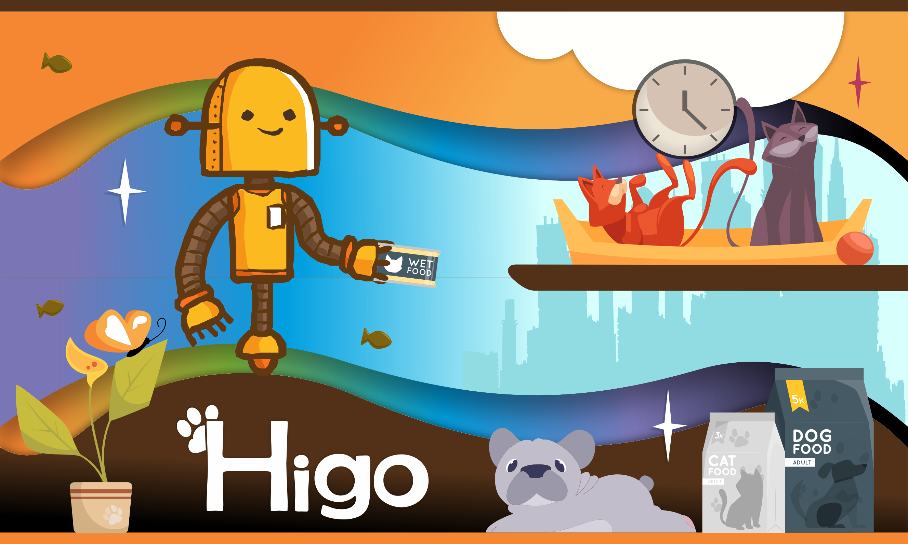

# 🎯 Google for Startups AI Agents Challenge Submission: Higo Agent

## Problem to solve
Building a scalable B2B2C network for pet care and local commerce faces severe real-world friction. Traditional neighborhood pet shops possess years of community trust but are losing an unequal digital battle against massive e-commerce conglomerates. When attempting to digitize these local micro-entrepreneurs via our B2B platform (Higo Op), we face a massive barrier: high technological rejection and fear of complex application interfaces from older merchants. This results in high manual sales prospecting times and low conversion rates. Concurrently, on the consumer side (Higo VIP), maintaining continuous daily user engagement and preventing churn within our free collaborative care features requires scalable, highly personalized value injection.

---

## Our solution
We built "Higo Agent - Autonomous Commerce Discovery & Care" under Track 2 (OPTIMIZE), transforming our stable multi-platform MVP into an advanced agentic ecosystem using Google's official Agent Development Kit (ADK). The solution operates through two core autonomous modules:

* **HigoDiscoveryAgent (Core B2B Optimization):** Operating on a ReAct (Reason + Action) loop powered by Gemini, this agent automates up to 70% of our commercial prospecting. It autonomously triggers whenever a user shares a new location on Higo VIP, scanning the area via Google Places API. It cross-checks local business directories and uses PlusCodes geopositioning to validate commercial boundaries and generate optimized hyper-local prospecting scripts for our sales team.
* **CareTipAgent (Engagement & B2C Innovation):** To drive retention, this agent delivers hyper-personalized daily pet care tips directly to users. To keep execution lightweight and cost-effective, the system feeds a pre-established, dynamically rotating general daily tip into the agent's context. The agent then customizes this foundational advice using basic available pet metadata (species, breed, gender, and age). This architecture allows the ecosystem to deliver immediate value without complex database overhead, with a clear roadmap to incorporate weight and advanced medical histories later.

---

## Technologies used
Our agentic infrastructure is natively built over Google Cloud and the official Google AI ecosystem:

* **Google Agent Development Kit (ADK):** Utilized as the foundational architecture framework using LimAgent configurations.
* **Gemini 2.5 Flash:** Selected as our core orchestration LLM due to its exceptional low latency, high token efficiency, and reliable tool-calling capabilities in production.
* **Model Context Protocol (MCP):** Implemented to establish standard, decoupled access vectors directly into our databases without hardcoded integrations.
* **Vertex AI Agent Engine & Cloud Run:** Providing a fully managed, serverless, and auto-scaling runtime environment for our microservices.
* **Flutter & Firebase:** Powering our existing cross-platform production apps (Higo VIP & Higo Op) and synchronized Firestore state.

---

## Data sources
The agent unifies and relies upon three main data vectors:

* **Google Places API:** Functions as our primary real-time grounding authority for identifying and verifying local businesses.
* **Cloud Firestore Ecosystem Data:** Accesses basic pet metadata profiles (species, breed, gender, and age) and user-submitted location states.
* **Hyperlocal PlusCodes Geo-Parametrization:** Utilizing 8-character PlusCodes to map localized operational grids (squares of approximately 270m² near the equator) to measure neighborhood density and active local commerce perimeters.

---

## Findings and learnings

* **Rigorous Semantic Engineering over Vibe-Testing:** Large Language Models are hyper-literal. Moving from loose prototyping to production-ready reliability required shifting completely away from "vibe-prompting." We learned that Gemini's tool-execution success relies entirely on providing strict Python Type Hints, rigorous semantic docstrings explaining exact tool utility, and structured return schemas.
* **Context Efficiency via Template Hydration:** We discovered that instead of passing vast medical histories or unbounded raw logs to create personalization, feeding a structured daily template tip and hydrating it with specific, basic pet metadata (species, breed, age) yields extremely high perceived personalization for the user while keeping token usage predictable, fast, and highly cost-effective.
* **Technology with a Human Purpose:** The ultimate goal of our software is to reduce the friction of care and protect life. We realized that an agent's architecture should match the current scale of the startup; starting with robust core data vectors (like species and breed) paves a sustainable path for advanced features like automated medical tracking in the near future.
