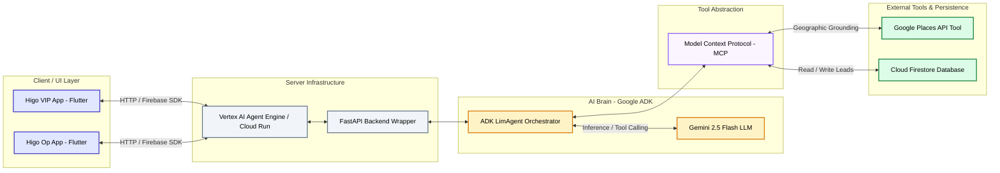
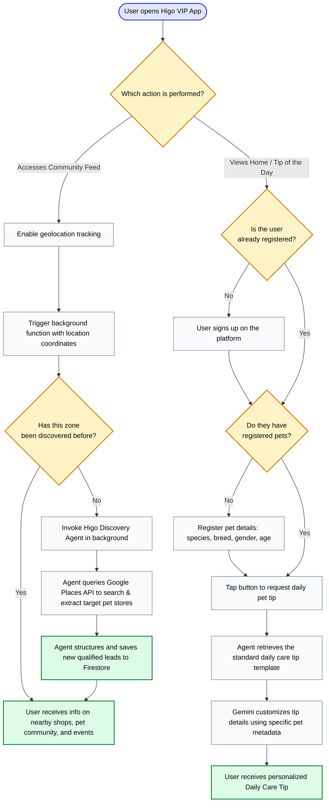

# Higo Agent Ecosystem Architecture & Process Flow

This document outlines the architectural blueprint and process flows of the **Higo Agent** ecosystem. It is designed to provide external stakeholders, challenge judges, and developers with a clear understanding of how the system operates under the hood without exposing sensitive credentials or proprietary backend configurations.

---

## 🏗️ Ecosystem Architecture

The Higo Agent ecosystem is structured into five distinct, decoupled layers. This design ensures high availability, security, and scalability by separating client applications, server execution environments, AI orchestration, tool integration, and data storage.

### Layer Breakdown

1. **Client / UI Layer (Flutter):**
   * **Higo VIP (B2C):** The customer-facing application where pet parents manage daily care, share photos, and interact with the community.
   * **Higo Op (B2B):** The dashboard used by local pet shops to manage inventory, catalog products, and receive localized orders without paying commissions.

2. **Server Infrastructure (Vertex AI & FastAPI):**
   * High-availability, serverless runtimes hosting our microservices.
   * FastAPI acts as a lightweight wrapper to handle requests, manage endpoint routing, and forward operations to the agentic core.

3. **AI Brain (Google ADK & Gemini):**
   * **ADK LimAgent Orchestrator:** Implements ReAct (Reason + Action) loop logic, system instructions, and tool registries.
   * **Gemini 2.5 Flash:** Selected as the primary LLM because of its industry-leading latency, token efficiency, and robust tool-calling accuracy.

4. **Tool Abstraction (MCP):**
   * Implements the **Model Context Protocol (MCP)** to establish standardized, decoupled access vectors. This allows the agents to query external databases and services safely without hardcoding integration logic.

5. **External Tools & Data (Places API & Firestore):**
   * **Google Places API:** Performs geographical grounding to search, identify, and verify local pet merchants in real-time.
   * **Cloud Firestore:** The central persistent storage containing user geo-states, basic pet profiles, and validated B2B leads.

---

## 🔄 Unified Process Flowchart

The following diagram illustrates how B2B prospecting (Higo Discovery Agent) and B2C engagement (Care Tip Agent) run in parallel, triggered by user actions within the mobile app.

### Process Integration

* **B2B Expansion Loop:** As users explore the app locally, they trigger the geolocation checks. The system automatically launches the **Discovery Agent** to build a comprehensive directory of neighborhood pet shops.
* **B2C Engagement Loop:** Once the local catalog grows, the **Care Tip Agent** can recommend local shops and specific products dynamically inside the personalized tips, closing the B2B2C loop by driving users to neighborhood stores.
