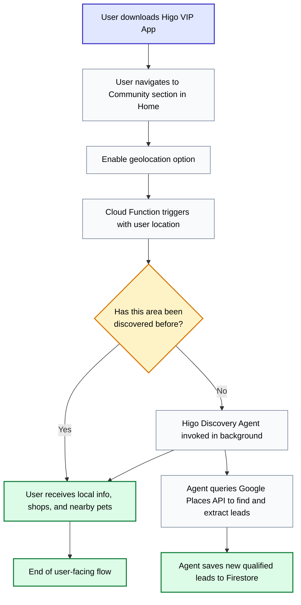
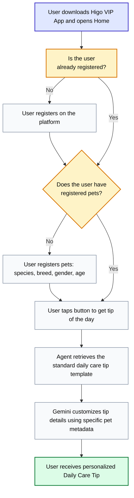

# Higo Agent - Commerce Discovery & Pet Care

An agentic multi-agent system built using the **Google GenAI SDK (Gemini 2.5 Flash)** and **Google Cloud (Firestore, Places API)**. It automates B2B merchant prospecting and enhances user retention in the **Higo** pet care ecosystem.

Designed for the **Google for Startups AI Agents Challenge (Track 2 - OPTIMIZE)**.

---

## 🧠 System Architecture

The project consists of two specialized agents:

1. **Higo Discovery Agent (`higo_discovery_agent`):** An autonomous B2B expansion agent that prospects target locations, searches for local pet businesses (via Places API), fetches real contact info/opening hours (via Places Details API), normalizes the scheduling structure to match Higo Core's schemas (`HorarioWeekModelV2`), and saves leads atomically to Firestore.
2. **Care Tip Agent (`care_tip_agent`):** A consumer-focused agent that generates daily pet care tips based on pet parameters (breed, age, weight) and recommends local store products to drive B2B adoption.

---

## 📂 Project Structure

* `agents/discovery/agent.py`: Agent definition, ReAct system instructions, and tool registry.
* `agents/discovery/agent_engine_app.py`: FastAPI server wrapper for Cloud Engine deployment.
* `agents/discovery/tools/discovery_tools.py`: Tools for Places Search, Places Details querying, normalizations, and Firestore integration with local fallback database (`leads_sandbox.json`).
* `tests/`: Integration and unit tests.
* `pyproject.toml`: Dependency configuration.

---

## 🚀 How to Run

### Setup Environment
```bash
# Set up Google Application Default Credentials
gcloud auth application-default login

# Export your Maps API Key
export GOOGLE_MAPS_API_KEY="your-api-key"
```

### Install Dependencies & Run Tests

```bash
# Run unit tests (always run, sandbox mode works offline)
uv run pytest tests/unit

# Run integration tests (skipped automatically if auth is expired)
uv run pytest tests/integration
```

---

## 📊 Process Flowcharts

### 1. Higo Discovery Agent Flow (B2B Expansion)



### 2. Care Tip Agent Flow (B2C Engagement)



---


